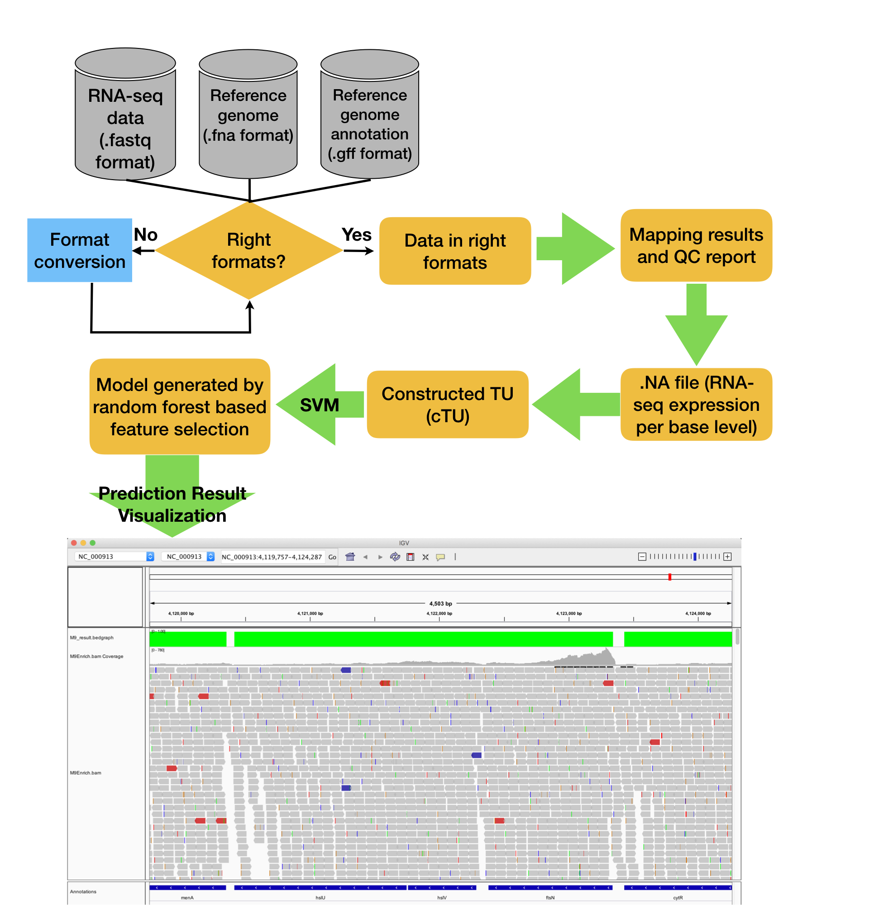
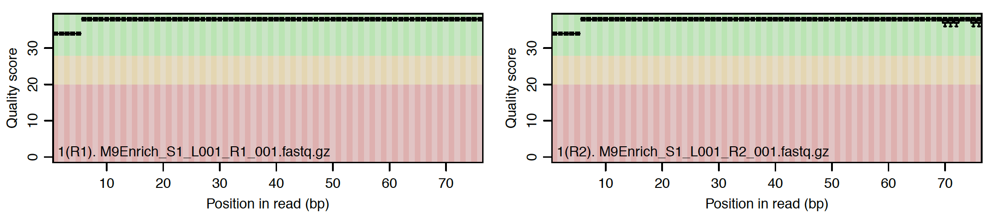
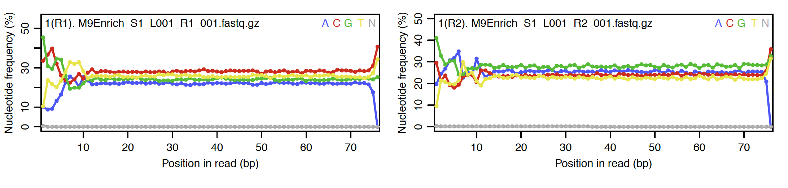
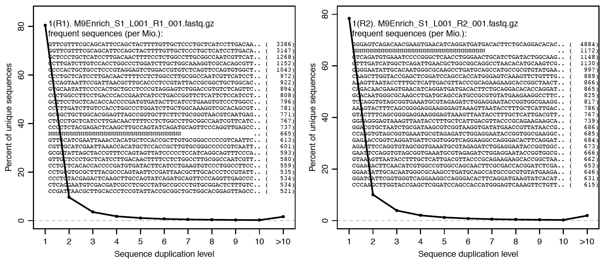
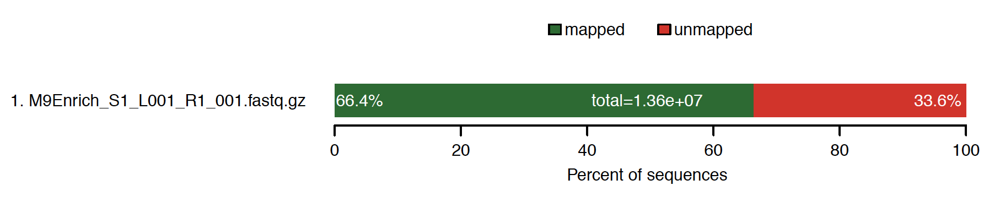
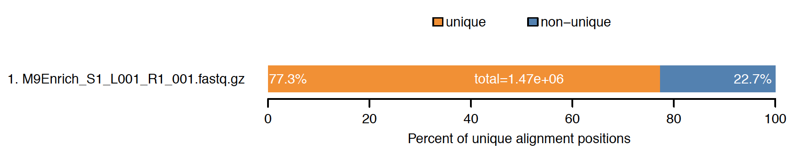
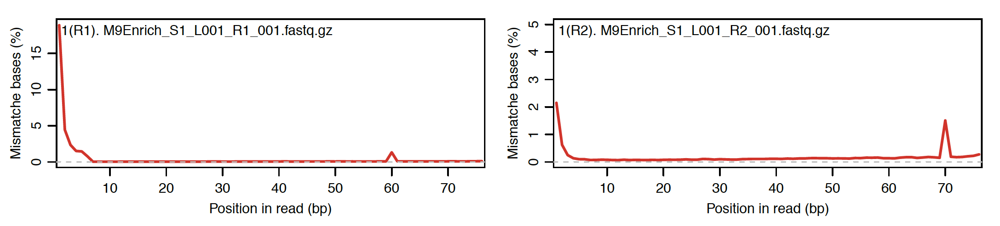
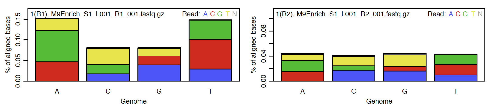
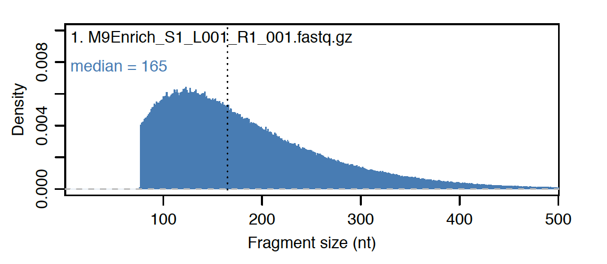
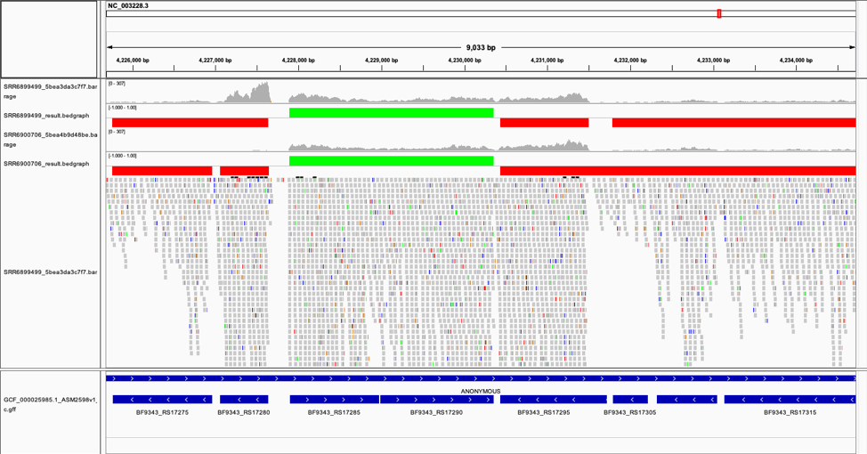

# Introduction
A transcriptional unit (TU) is composed of one or multiple consecutive genes on the same strand of a
bacterial genome. The genes within a TU are transcribed into a single mRNA to respond to specific
growth conditions, and the TU are regulated by one promoter. To delineate the transcriptional regulatory
networks, it is a crucial first step to identify TUs within a bacterial genome accurately. To allow users to
efficiently perform TU identification on their machine and provide a more accurate prediction, we
develop an R package, named rSeqTU. rSeqTU R package can automatically select essential TU features
through a random forest algorithm in a machine learning framework. Besides, rSeqTU performs nearly
98% accuracy in most of our testing TU cases, e.g., public RNA-Seq datasets of E. coli. Users will be able to 
install the rSeqTU package from Github and input their customized RNA-Seq dataset to conduct
de-multiplexing, quality controlling, reads alignment, random-forest-based feature selection, prediction
model training, and TU prediction. Moreover, rSeqTU presents results in interactive visualizations for customized downstream analysis. rSeqTU also output read count matrix of both genes and TUs for further differentially expression analysis.

# Enviroment
The rSeqTU R package has been tested on Mac and Linux OS. 

# Workflow



# Quick Start

### Install package
```R
library(devtools)
install_github("s18692001/rSeqTU")
library(rSeqTU)
```

### Download Datasets

Please download the sample datasets from this [link](http://bmbl.sdstate.edu/downloadFiles/seqtu_data/). 

Notice: Please prepare genome sequence (fasta) and other necessary genome annotation files.


### Alignment
```R
library(QuasR)
library(Rsamtools)
# Set up your working directory
setwd("working_dir")

# Set up parameters of file paths for alignment
sampleFile <- "sampleFile.txt"
genomeFile <- "GCF_000005845.2_ASM584v2_genomic.fna"
genome_gff <- "GCF_000005845.2_ASM584v2_genomic.gff"
proj <- qAlign(sampleFile, genomeFile, paired="fr", clObj = makeCluster(detectCores()))
```

```
    create 1 genomic alignment(s)
will start in ..9s..8s..7s..6s..5s..4s..3s..2s..1s
Testing the compute nodes...OK
Loading QuasR on the compute nodes...OK
Available cores:
nodeNames
  syniu 
     16 
Performing genomic alignments for 1 samples. See progress in the log file:
local/QuasR_log_1ccc01b031f84.txt
Genomic alignments have been created successfully
```

### Quality Check


```R
# get Quality Check report and statistics
qQCReport(proj, pdfFilename="qc_report_test.pdf")
alignmentStats(proj)
```











```
                 seqlength  mapped unmapped
M9_Enrich:genome   4641652 9043282  4574532
```

### Generate sum of the mapped read depths at each reference base position (.NA file)


```R
# Generate .NA file for constructing cTU
gen_NA("M9Enrich_S2_L001_R1_001_1ccc063fe8630.bam", "NC_000913.3", "M9")
gen_cTU_data("M9.NA", "test", genome_gff, genomeFile)
```
```
Reading the plot file ... 
Reading gene annotations from the gff file ... 
Done with reading gene annotations from the gff file ... 
In this genome, there are
 1) 2120 forward genes and
 2) 2194 reverse genes.
Reading genome sequence for the fna file ... 
Done with reading genome sequence from the fna file ... 
The input genome is 4641652 bp long.
Reading intergenic regions ... 
Done with reading intergenic regions ... 
In this genome, there are
 1) 2119 forward intergenic regions and
 2) 2193 reverse intergenic regions.
11.Proportion of intergenic region's length and sum length of flanking two genes on forward strand:	-1.346405	0.008251439	0.07152975	0.227127	0.4181184	0.9808429	
12.Proportion of intergenic region's length and sum length of flanking two genes on reverse strand:	-13.5	0.007472826	0.06696182	0.2081948	0.3930085	0.9899026	
```


### SVM modeling and prediction

```R
# Train model and generate prediction result in .bedgraph format
TU_SVM("SimulatedPositiveTUMatrix.txt", "SimulatedNegativeTUMatrix.txt", "TargetPositiveTUMatrix.txt", "TargetNegativeTUMatrix.txt","M9.NA", genome_gff, "M9", "NC_000913")
```

```
'data.frame':	3302 obs. of  17 variables:
 $ ExpressionMean1: num  277 141 53.6 31.4 6.5 ...
 $ ExpressionMean2: num  245.3 49 47.2 44.7 14.4 ...
 $ ExpressionMean3: num  95.9 65.5 34.9 23.3 14.2 ...
 $ ExpressionMean4: num  215.7 105.5 45.8 28.1 13.3 ...
 $ ExpressionSD1  : num  2.739 43.651 24.134 9.219 0.877 ...
 $ ExpressionSD2  : num  85.63 3.49 1.5 1.72 3.26 ...
 $ ExpressionSD3  : num  7.06 19.6 13.96 10.38 10.44 ...
 $ ExpressionSD4  : num  95.04 51.61 22.48 10.87 6.81 ...
 $ GapProportion1 : num  0 0 0 0 0 0 0 0 0 0 ...
 $ GapProportion2 : num  0 0 0 0 0 0 0 0 0 0 ...
 $ GapProportion3 : num  0 0 0 0 0 0 0 0 0 0 ...
 $ GapProportion4 : num  0 0 0 0 0 0 0 0 0 0 ...
 $ GapLongest1    : int  0 0 0 0 0 0 0 0 0 0 ...
 $ GapLongest2    : int  0 0 0 0 0 0 0 0 0 0 ...
 $ GapLongest3    : int  0 0 0 0 0 0 0 0 0 0 ...
 $ GapLongest4    : int  0 0 0 0 0 0 0 0 0 0 ...
 $ GeneFoldChange : num  2.89 2.15 1.54 1.35 2.18 ...
'data.frame':	1021 obs. of  17 variables:
 $ ExpressionMean1: num  13.2593 23.2785 0.0943 10.9635 8.8514 ...
 $ ExpressionMean2: num  31.98 8.65 11.75 139.14 50.52 ...
 $ ExpressionMean3: num  146.9078 0.0943 15.8727 128.1815 153.3029 ...
 $ ExpressionMean4: num  58.27 11.59 3.59 106.27 74.88 ...
 $ ExpressionSD1  : num  6.807 8.597 0.494 4.69 3.985 ...
 $ ExpressionSD2  : num  42.34 2.04 7.06 26.21 74.73 ...
 $ ExpressionSD3  : num  44.188 0.494 4.792 39.829 29.451 ...
 $ ExpressionSD4  : num  64.95 12.73 6.66 58.18 75.32 ...
 $ GapProportion1 : num  0 0 0.963 0 0 ...
 $ GapProportion2 : num  0 0 0.00508 0 0 ...
 $ GapProportion3 : num  0 0.963 0 0 0 ...
 $ GapProportion4 : num  0 0.449 0.688 0 0 ...
 $ GapLongest1    : int  0 0 1072 0 0 0 212 24 0 0 ...
 $ GapLongest2    : int  0 0 2 0 0 282 7 16 0 6 ...
 $ GapLongest3    : int  0 1072 0 0 0 113 0 0 6 0 ...
 $ GapLongest4    : int  0 1072 1072 0 0 682 212 24 6 6 ...
 $ GeneFoldChange : num  11.1 246.8 168.3 11.7 17.3 ...
```

### Visualization in IGV (Import the .bedgraph, reference genome and annotation files)
For tutorial of IGV, please check http://software.broadinstitute.org/software/igv/userguide




### Read counts matrix of gene and TU for downstream analysis such as differential expression analysis
```
TU0001	190	9893	+	1	EcoGene:EG11277,GeneID:944742 EcoGene:EG10998,GeneID:945803 EcoGene:EG10999,GeneID:947498 EcoGene:EG11000,GeneID:945198 EcoGene:EG14384,GeneID:944747 EcoGene:EG11556,GeneID:944748 EcoGene:EG11511,GeneID:944760
TU0002	5683	11786	-	1	EcoGene:EG10011,GeneID:944749 EcoGene:EG11555,GeneID:944745 EcoGene:EG11512,GeneID:944792 EcoGene:EG14340,GeneID:944771 EcoGene:EG11513,GeneID:944751
TU0003	12163	15298	+	1	EcoGene:EG10241,GeneID:944750 EcoGene:EG10240,GeneID:944753
TU0004	15445	16557	+	1	EcoGene:EG40012,GeneID:944754
TU0005	16751	20314	-	1	EcoGene:EG12074,GeneID:944756 EcoGene:EG10373,GeneID:2847744 EcoGene:EG40002,GeneID:944743
TU0006	16952	17006	+	1	EcoGene:EG31128,GeneID:2847745
TU0007	17489	19620	+	1	EcoGene:EG10652,GeneID:944758 EcoGene:EG11078,GeneID:944757
TU0008	20233	20508	-	1	EcoGene:EG40001,GeneID:948449
TU0009	20815	21078	-	1	EcoGene:EG10919,GeneID:944759
TU0010	21181	27227	+	1	EcoGene:EG14386,GeneID:949128 EcoGene:EG11079,GeneID:949129 EcoGene:EG10492,GeneID:944761 EcoGene:EG10548,GeneID:944800 EcoGene:EG11080,GeneID:944807 EcoGene:EG11081,GeneID:944777
TU0011	27293	28207	+	1	EcoGene:EG11082,GeneID:944796
```


