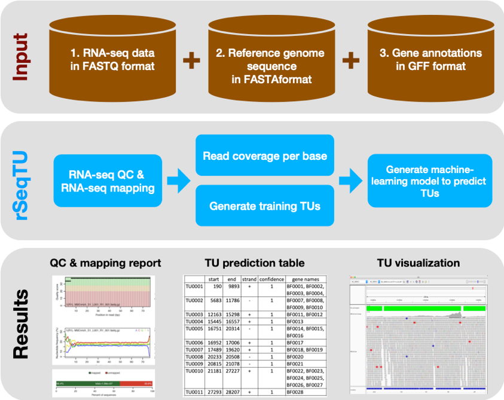
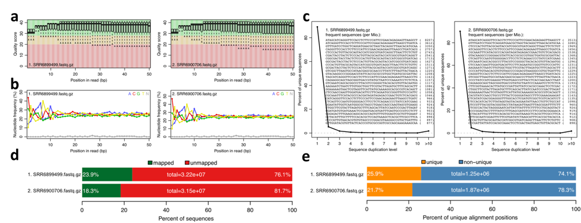

# Introduction
A transcriptional unit (TU) is composed of one or multiple consecutive genes on the same strand of a
bacterial genome. The genes within a TU are transcribed into a single mRNA to respond to specific
growth conditions, and the TU are regulated by one promoter. To delineate the transcriptional regulatory
networks, it is a crucial first step to identify TUs within a bacterial genome accurately. To allow users to
efficiently perform TU identification on their machine and provide a more accurate prediction, we
develop an R package, named rSeqTU. rSeqTU R package can automatically select essential TU features
through a random forest algorithm in a machine learning framework. Besides, rSeqTU performs nearly
98% accuracy in most of our testing TU cases, e.g., public RNA-Seq datasets of E. coli. Users will be able to 
install the rSeqTU package from Github and input their customized RNA-Seq dataset to conduct
de-multiplexing, quality controlling, reads alignment, random-forest-based feature selection, prediction
model training, and TU prediction. Moreover, rSeqTU presents results in interactive visualizations for customized downstream analysis. rSeqTU also output read count matrix of both genes and TUs for further differentially expression analysis.

# Enviroment
The rSeqTU R package has been tested on Mac and Linux OS. 

# Workflow



# Quick Start

### Install package
```R
library(devtools)
install_github("s18692001/rSeqTU")
library(rSeqTU)
```

### Download Datasets

Please download the sample datasets from NCBI SRA database. Two data sets are SRR6899499 (ccfA overexpression) and SRR6900706 (wild-type). 
The reference genome sequence and gene annotations of Bacteroides fragilis NCTC 9343 are GCF_000025985.1_ASM2598v1_genomic.fna and GCF_000025985.1_ASM2598v1_genomic.gff.


### Alignment
```R

library(QuasR)
library(Rsamtools)
library(rSeqTU)
library(seqinr)
setwd("/Users/syniu/rSeqTU/microbiome_test/data")

# Set up parameters of file paths for alignment
sampleFile <- "sampleFile.txt"
genomeFile <- "GCF_000025985.1_ASM2598v1_genomic.fna"
genome_gff <- "GCF_000025985.1_ASM2598v1_genomic.gff"
proj <- qAlign(sampleFile, genomeFile, paired="no", clObj = makeCluster(detectCores()))
```

```
    create 1 genomic alignment(s)
will start in ..9s..8s..7s..6s..5s..4s..3s..2s..1s
Testing the compute nodes...OK
Loading QuasR on the compute nodes...OK
Available cores:
nodeNames
  xxxx 
     16 
Performing genomic alignments for 2 samples. See progress in the log file:
local/QuasR_log_1ccc01b031f84.txt
Genomic alignments have been created successfully
```

### Quality Check


```R
# get Quality Check report and statistics
qQCReport(proj, pdfFilename="qc_report_test.pdf")
alignmentStats(proj)
```




```
                  seqlength  mapped unmapped
SRR6899499:genome   5241700 7692552 24556548
SRR6900706:genome   5241700 5774831 25756600

```

### Generate sum of the mapped read depths at each reference base position (.NA file)


```R
# Generate .NA file for constructing cTU
gen_NA("fastq/SRR6899499_5bea3da3c7f7.bam", "NC_003228.3", "SRR6899499")
gen_cTU_data("SRR6899499.NA", "SRR6899499", genome_gff, genomeFile)
```
```
Reading the plot file ... 
Reading gene annotations from the gff file ... 
Done with reading gene annotations from the gff file ... 
In this genome, there are
 1) 2195 forward genes and
 2) 2293 reverse genes.
Reading genome sequence for the fna file ... 
Done with reading genome sequence from the fna file ... 
The input genome is 5205140 bp long.
Reading intergenic regions ... 
Done with reading intergenic regions ... 
In this genome, there are
 1) 2194 forward intergenic regions and
 2) 2292 reverse intergenic regions.
11.Proportion of intergenic region's length and sum length of flanking two genes on forward strand:	-5.605863	0.006151008	0.03838312	0.177702	0.2705315	0.9840084	
12.Proportion of intergenic region's length and sum length of flanking two genes on reverse strand:	-5.535354	0.006740167	0.04055088	0.1785426	0.2544108	0.9854094	
```


### SVM modeling and prediction

```R
# Train model and generate prediction result in .bedgraph format
TU_SVM("SimulatedPositiveTUMatrix.txt", "SimulatedNegativeTUMatrix.txt", "TargetPositiveTUMatrix.txt", "TargetNegativeTUMatrix.txt","SRR6899499.NA", genome_gff, "SRR6899499", "NC_003228.3")
```

```
'data.frame':	2689 obs. of  17 variables:
 $ ExpressionMean1: num  31.55 2.71 28.16 27.35 11.12 ...
 $ ExpressionMean2: num  20.6 2 9.8 11.4 10 ...
 $ ExpressionMean3: num  0 3.98 15.64 11.12 14.62 ...
 $ ExpressionMean4: num  23 3.2 17 14.4 12.5 ...
 $ ExpressionSD1  : num  9.97 1.16 11.59 12.04 5.25 ...
 $ ExpressionSD2  : num  10.63 0 3.82 4.21 0 ...
 $ ExpressionSD3  : num  0 2.58 3.91 3.03 10.17 ...
 $ ExpressionSD4  : num  11.13 1.94 11.27 8.94 7.76 ...
 $ GapProportion1 : num  0 0.0526 0 0 0 ...
 $ GapProportion2 : num  0.0208 0 0 0 0 ...
 $ GapProportion3 : num  1 0.122 0 0 0 ...
 $ GapProportion4 : num  0.00379 0.07937 0 0 0 ...
 $ GapLongest1    : int  0 7 0 0 0 0 0 0 0 0 ...
 $ GapLongest2    : int  0 0 0 0 0 2 0 0 0 0 ...
 $ GapLongest3    : int  0 12 0 0 0 18 0 26 5 0 ...
 $ GapLongest4    : int  0 12 0 0 0 26 0 26 5 0 ...
 $ GeneFoldChange : num  3.16e+06 1.47 1.80 2.46 1.31 ...
'data.frame':	910 obs. of  17 variables:
 $ ExpressionMean1: num  252.22 22.69 1.34 1.21 13.03 ...
 $ ExpressionMean2: num  58.6021 3.6 0.0673 1.4795 2.2349 ...
 $ ExpressionMean3: num  13.574 1.655 13.279 13.031 0.446 ...
 $ ExpressionMean4: num  69.78 10 3.09 6.1 2.49 ...
 $ ExpressionSD1  : num  34.779 11.457 1.216 0.635 8.193 ...
 $ ExpressionSD2  : num  52.408 0.807 0.349 1.224 3.144 ...
 $ ExpressionSD3  : num  7.216 1.953 3.782 8.193 0.933 ...
 $ ExpressionSD4  : num  76.83 12.63 4.72 7.8 5.3 ...
 $ GapProportion1 : num  0 0 0.284 0.105 0 ...
 $ GapProportion2 : num  0.0576 0 0.9519 0.1988 0.4095 ...
 $ GapProportion3 : num  0 0.348 0 0 0.738 ...
 $ GapProportion4 : num  0.0432 0.2053 0.2849 0.0909 0.561 ...
 $ GapLongest1    : int  0 0 120 15 0 73 99 0 0 29 ...
 $ GapLongest2    : int  110 0 99 22 17 0 61 0 16 206 ...
 $ GapLongest3    : int  0 129 0 0 281 261 0 0 15 501 ...
 $ GapLongest4    : int  110 129 177 22 367 261 99 0 16 501 ...
 $ GeneFoldChange : num  18.58 13.71 9.87 10.77 29.22 ...
```

### Visualization in IGV (Import the .bedgraph, reference genome and annotation files)
For tutorial of IGV, please check http://software.broadinstitute.org/software/igv/userguide


### Read counts matrix of gene and TU for downstream analysis such as differential expression analysis
```
TU0001  67      722     +       1       BF9343_RS00005 BF9343_RS21315
TU0002  749     2218    +       1       BF9343_RS00010
TU0003  1147    2157    +       1       BF9343_RS21320
TU0004  2154    2889    -       1       BF9343_RS21325
TU0005  2211    3182    +       1       BF9343_RS00015
TU0006  2329    2889    -       1       BF9343_RS23515
TU0007  3196    3515    +       1       BF9343_RS00020 BF9343_RS21330
TU0008  3580    3798    +       1       BF9343_RS21335
TU0009  3830    4168    +       1       BF9343_RS21340
TU0010  4069    5729    +       1       BF9343_RS00025 BF9343_RS21345 BF9343_RS21350 BF9343_RS00030 BF9343_RS21355 BF9343_RS21360 BF9343_RS21365
TU0011  5893    7050    +       1       BF9343_RS21375
TU0012  6658    8469    +       1       BF9343_RS00035
TU0013  8217    8573    +       1       BF9343_RS21380
TU0014  8625    9743    +       1       BF9343_RS00040
TU0015  8696    8878    +       1       BF9343_RS23520
TU0016  9008    10570   +       1       BF9343_RS21385
TU0017  9724    10392   +       1       BF9343_RS00045
TU0018  10389   11747   +       1       BF9343_RS00050
TU0019  10586   11209   +       1       BF9343_RS21390
TU0020  11268   11702   +       1       BF9343_RS21395

```


